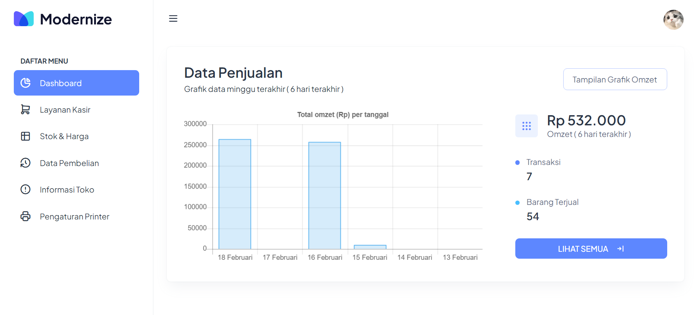
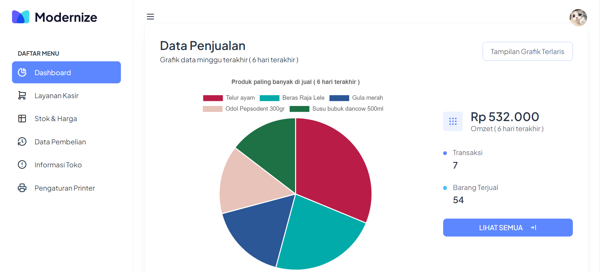
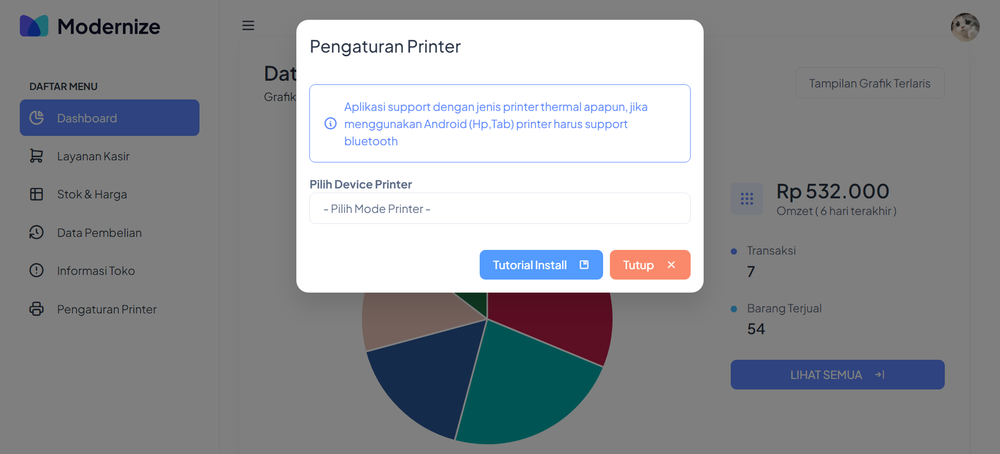
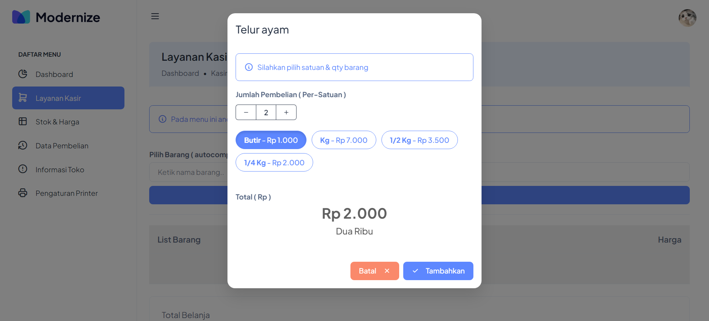
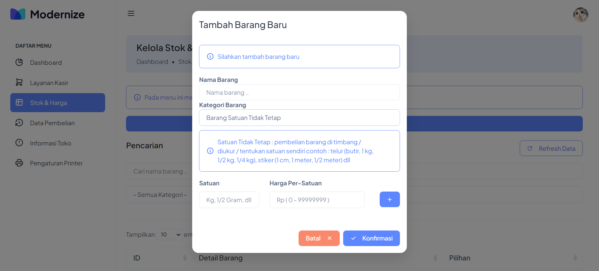

## Aplikasi Kasir POS - Laravel

### Deskripsi
Aplikasi Kasir POS sistem manajemen penjualan dan persediaan stok barang, dirancang untuk memperlancar operasi bisnis ritel (cocok untuk toko sembako / kelontong). Dengan aplikasi ini, bisnis dapat dengan mudah mengelola transaksi penjualan, melacak tingkat persediaan secara real-time, menghasilkan dashboard yang informatif, dan banyak lagi.

### Preview Aplikasi
- **Tampilan grafik omzet**
  

- **Tampilan grafik terlaris**
  

- **Tampilan pengaturan printer**
  

- **Tampilan modal tambah list belanjaan**
  

- **Tampilan tambah barang (multi satuan)**
  

- **Tampilan tambah barang (ecer & grosir)**
  

### Fitur
- **Multi Satuan**: Mendukung pengelolaan produk dengan beberapa satuan : misal penjualan telur (1/2 Kg, 1/4 Kg, 1 Kg), stiker (1 Meter, 1 Cm, dll) memudahkan dalam pengaturan inventaris.
- **Jual Ecer / Grosir**: Barang di bedakan menjadi 2 kategori "Satuan Tetap" & "Satuan Tidak Tetap". Satuan tetap untuk barang yang bisa dijual eceran & grosir contoh : bolpoin, sabun, buku, dll. Satuan tidak tetap untuk barang yang satuan penjualannya lebih dari 1 (dijelaskan pada poin sebelumnya)
- **Dukungan Thermal Printer**: Kompatibel dengan printer termal untuk mencetak struk transaksi pada perangkat Android dan PC.
- **Custom Nama Toko & Alamat**: Memungkinkan untuk menyesuaikan nama toko dan alamat sesuai kebutuhan bisnis.
- **Buka Cashdrawer Otomatis**: (Masih dalam proses pengembangan) Fitur untuk membuka laci kas secara otomatis saat transaksi selesai.
- **Manajemen Pengguna**: (Masih dalam proses pengembangan) Membuat akun pengguna dengan tingkat akses yang berbeda untuk mengontrol izin sistem.

### Teknologi yang Digunakan
- **Backend**: Laravel
- **Frontend**: Javascript, Bootstrap 
- **Database**: MySQL
- **Dukungan Hardware**: Thermal Printer (Android & PC)

### Instalasi
1. Clone repository: `git clone https://github.com/ali819/kasir.git`
2. Masuk ke direktori proyek: `cd kasir`
3. Instal dependensi: `composer install`
4. Salin file `.env.example` dan ubah nama menjadi `.env`.
5. Konfigurasi koneksi database di file `.env`.
6. Jalankan migrasi untuk membuat tabel: `php artisan migrate`
7. Jalankan aplikasi: `php artisan serve`

### Penggunaan
1. Akses aplikasi melalui browser web di `http://localhost:8000`.
2. Masuk dengan kredensial Anda atau daftar untuk akun baru (silahkan hilangkan disabled HTML button register pada login.blade.php & url pada folder routes/auth.php untuk register).
3. Mulai mengelola penjualan, inventaris, sesuai kebutuhan bisnis Anda.

### Kontributor
- @ali819 - [https://alisabana.my.id](https://alisabana.my.id)

### Template
https://adminmart.com

### Lisensi
Proyek ini dilisensikan di bawah Lisensi MIT. Lihat file [LICENSE](LICENSE) untuk detailnya.

### Dukungan
Jika Anda menyukai proyek ini dan ingin memberikan dukungan, Anda dapat membelikan saya secangkir kopi melalui 

Untuk pertanyaan atau bantuan terkait proyek, silakan hubungi <a href="mailto:ali.sabana819@gmail.com">ali.sabana819@gmail.com</a>.

### Roadmap
- Menyelesaikan pengembangan fitur buka cashdrawer otomatis.
- Menambahkan dukungan untuk pembayaran online.
- Mengimplementasikan desain responsif untuk penggunaan yang lebih baik pada perangkat mobile.
